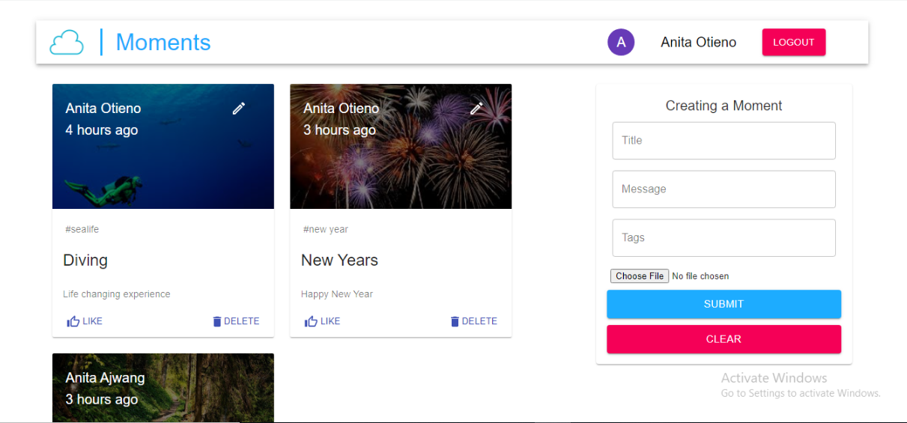
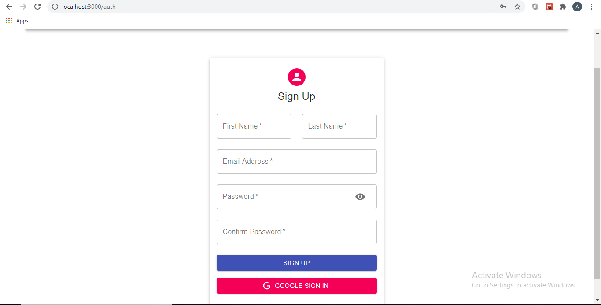

# Moment
This is a simple social media MERN application that allows users to post interesting events that happened in their lives

## Sample Screenshots

## Languages and Technologies Used
* MERN STACK (MongoDB, Express, React, Nodejs)
* HTML
* CSS
* Material UI
* Google OAuth API

## Before Using

Make sure:
* Nodejs is installed (https://nodejs.org/)
* You have a MongoDB Atlas account

## Packages to Install
### Client
* npm install axios moment react-file-base64 redux redux-thunk @material-ui/core react-redux react-router react-router-dom 
* Authentication
   * npm install jwt-decode react-google-login
### Server
* Generate package.json file
  * npm init -y
* npm install mongoose express dotenv cors nodemon
* Authentication
    * npm install bcryptjs jsonwebtoken
## Package.Json
* Client
    * Add "proxy": "http://localhost:5000" (5000 is the port the server is listening to)
* Server
    * Add "type" : "module"  (to use import syntax instead of require)

## .env File
* Create a .env file in your root folder
* In it create a variable called DB_CONNECTION
  * DB_CONNECTION = mongodb+srv://user:<password>@cluster0......./<dbname>?retryWrites=true&w=majority
## Usage
To run the project, please use the following command:
* npm start
  * It will run the server on port 5000
  * It will run the client on port 3000
